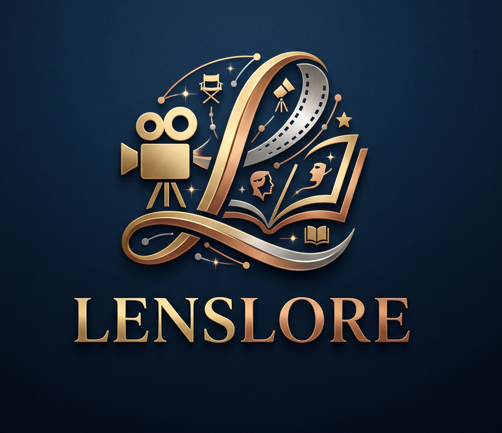

<br />
<div align="center">
  <a href="https://github.com/Amber-s-art/LensLore">
    
  </a>

  <h3 align="center">LensLore 🎞️✨</h3>

  <p align="center">
    <strong>Lens = Cinema. Lore = Knowledge.</strong><br>
    An intelligent cinematic discovery engine for Bollywood and Hollywood.
    <br />
    <br />
    <a href="https://github.com/Amber-s-art/LensLore"><strong>Explore the project »</strong></a>
    <br />
    <br />
    <a href="https://github.com/Amber-s-art/LensLore/issues">Report Bug</a>
    ·
    <a href="https://github.com/Amber-s-art/LensLore/issues">Request Feature</a>
  </p>
</div>

<div align="center">
  
  
  
  
</div>

---

<details>
  <summary>Table of Contents</summary>
  <ol>
    <li><a href="#about-the-project">About The Project</a></li>
    <li><a href="#tech-stack">Tech Stack</a></li>
    <li><a href="#getting-started">Getting Started</a></li>
    <li><a href="#usage">Usage</a></li>
    <li><a href="#repository-structure">Repository Structure</a></li>
    <li><a href="#roadmap">Roadmap</a></li>
    <li><a href="#license">License</a></li>
  </ol>
</details>

---

## 📖 About The Project

Welcome to **LensLore**—where cinema meets data. LensLore is an intelligent cinematic discovery engine tailored for both Bollywood and Hollywood. Moving beyond basic filters, it leverages **TF-IDF** and **Cosine Similarity** to surface highly accurate film recommendations based on deep thematic tags, genres, and cast members. 

The entire experience is wrapped in a premium, editorial-style interface that makes exploring movies as captivating as watching them.

### ✨ Key Features
* 🌍 **Dual-Industry Database:** Seamlessly toggle between Bollywood and Hollywood cinematic universes.
* 🧠 **Smart Content-Based Filtering:** Analyzes tags, genres, overviews, and cast to find the most conceptually similar films.
* 🎭 **Deep Customization:** Filter the universe of films by specific genres or your favorite actors.
* 🎬 **Interactive Cinematic UI:** A custom Streamlit interface with a running film strip, glowing animations, and interactive movie cards with blur-on-hover synopsis reveals.
* 🔗 **Smart Media Links:** Automatically fetches real-time data via the **TMDB API**, prioritizing YouTube trailers, then official homepages.
* 📊 **Silent Analytics Logging:** Tracks user queries in a hidden backend CSV (`logs/recom.csv`) for future model evaluation.

---

## 🛠️ Tech Stack

This project is built using the following technologies:

* **[Python 3](https://www.python.org/)** - Core logic and data processing
* **[Streamlit](https://streamlit.io/)** - Frontend framework (with custom CSS/HTML injection)
* **[Scikit-Learn](https://scikit-learn.org/)** - Machine Learning (TF-IDF Vectorization, NearestNeighbors)
* **[Pandas](https://pandas.pydata.org/)** - Data manipulation
* **[TMDB API](https://developer.themoviedb.org/docs)** - Live posters, ratings, and trailers

---

## 🚀 Getting Started

To get a local copy up and running, follow these simple steps.

### Prerequisites
Make sure you have Python installed on your machine. You will also need a TMDB API Read Access Token.
* Create a free account at [TMDB](https://www.themoviedb.org/) and navigate to Settings > API to generate your token.

### Installation

1. **Clone the repository:**
   ```bash
   git clone [https://github.com/Amber-s-art/LensLore.git](https://github.com/Amber-s-art/LensLore.git)
   cd LensLore

1. **Clone the repository:**
   ```bash
   git clone [https://github.com/Amber-s-art/LensLore.git](https://github.com/Amber-s-art/LensLore.git)
   cd LensLore

2. **Create a virtual environment (Recommended):**
   ```bash
   python -m venv venv
source venv/bin/activate  # On Windows use `venv\Scripts\activate`

3. **Install the required dependencies:**
   ```bash
   pip install -r requirements.txt

4. **Add your TMDB API Key:**
   Open `app.py` and replace the placeholder `TMDB_HEADERS` token with your own Bearer token.

5. **Ensure the datasets are in place:**
   Verify that `dataset/cleaned/bollywood_cleaned.csv` and `dataset/cleaned/hollywood_cleaned.csv` exist.

6. **Run the application:**
   ```bash
   streamlit run app.py

### 💻 Usage
1. Open http://localhost:8501 in your browser.

2. Select your preferred industry (Bollywood or Hollywood).

3. Filter the catalog by Genre or Actor.

4. Select a specific movie from the dropdown.

5. Click "Discover Films" to generate 5 highly correlated recommendations based on the movie's thematic tags.

6. Hover over any movie card to read its synopsis, or click the card to watch the trailer.

### 📁 Repository Structure

LensLore/
│
├── assets/
│   └── logo.png                 # App logo and UI assets
├── dataset/
│   └── cleaned/
│       ├── bollywood_cleaned.csv  # Pre-processed Bollywood dataset
│       └── hollywood_cleaned.csv  # Pre-processed Hollywood dataset
├── notebooks/
│   ├── data_overview.ipynb      # EDA and data exploration
│   └── data_modifying.ipynb     # Data cleaning logic
├── app.py                       # Main Streamlit application and UI
├── requirements.txt             # Python dependencies
└── README.md                    # Project documentation

### 🔮 Roadmap
. [x] Initial release with TF-IDF and Cosine Similarity

. [x] Implement TMDB API for live posters and trailers

. [x] Custom CSS for premium UI

. [ ] Collaborative Filtering: Integrate user-rating data to suggest films based on similar user profiles.

. [ ] Data Pipeline Automation: Automatically pull in newly released movies weekly.

. [ ] Analytics Dashboard: Create an admin page to visualize data from logs/recom.csv.

### 📝 License
Distributed under the MIT License.

### 🙏 Acknowledgments
The Movie Database (TMDB) for providing the API that powers the posters and metadata.

Streamlit for an incredible rapid prototyping framework.
